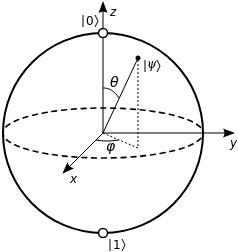

# Quantum ooga-booga basics

Naglis Šuliokas

The Science Guild

2024-01-13

---

## Recap

$\ket1$, $\ket0$, $H$, $X$, $Y$, $Z$, $R_X(\theta)$, $R_Y(\theta)$, $R_Z(\varphi)$

$|\psi\rangle = e^{i\gamma}(\cos \frac \theta 2 |0\rangle + e^{i \varphi} \sin \frac \theta 2 |1\rangle)$

Superposition & entanglement

---

## Phase kickback

---

## Superdense coding

Bell states

$\ket{\Phi^+} = \text{CNOT} \, ( H \otimes I ) \ket{0} \otimes \ket{0} = \frac{1}{\sqrt{2}} ( \ket{00} + \ket{11} )$, encodes 00

$\ket{\Phi^-} = \hspace{2cm} (Z \otimes I) \ket{\Phi^+} = \frac{1}{\sqrt{2}} ( \ket{00} - \ket{11} )$, encodes 10

$\ket{\Psi^+} = \hspace{1.9cm} (X \otimes I) \ket{\Phi^+} = \frac{1}{\sqrt{2}} ( \ket{01} + \ket{10} )$, encodes 01

$\ket{\Psi^-} = \hspace{1.8cm} (iY \otimes I)\ket{\Phi^+} = \frac{1}{\sqrt{2}} ( \ket{01} - \ket{10} )$, encodes 11

---

## Phase oracle & other

