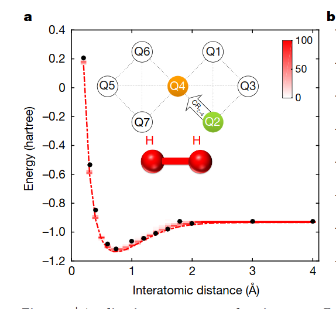

# Bachelor thesis

VQE algorithm performance analysis on various molecules

- [Paper in progress, official plan](https://www.overleaf.com/read/zpvkyxyfzpmn#c1c979)
- [Running basic case of QC on simulator & hardware, estimator & sampler](./../GENERAL/qiskit-tryouts/RUNNING_BASIC_CIRCUIT.ipynb)
- [Running VQE on simulator & hardware](./R!-run-on-q-hardware/R1-run-on-q-hardware.ipynb), the latter has problems, documented [here](./R!-run-on-q-hardware/Failing_vqe_case.ipynb)

## Plan

Official plan (far from reality):

- (21 March 2025) Conduct literature analysis on the whole VQE algorithm process and variations, finding recommendations on what ansätze, classical optimizer, second quantization methods.
- (4 April 2025) Conduct literature analysis, determining which molecules, how and on what quantum and classical hardware can be tested. What is the performance of VQE on different molecule data input, as of today, what are the perceived possibilities on implementing this algorithm in computational chemistry, what are the limitations.
- (18 April 2025) Test theoretical literature analysis outcome on quantum hardware, comparing the results.
- (2 May 2025) Conduct empirical experiment with selected molecule data on selected devices.
- (16 May 2025) Performing analysis on empirical data, yielding conclusions on current possibilities and limitations.

Official deadlines:

- **2025-05-23 10:00 Hand in**

Actual plan:

1. In parallel:

- run VQE algorithm on IBMQ hardware (and other devices)
- write introduction (briefly read and familiarize with a lot of articles; list experiments and metrics, possibly will change)

2. In parallel:

- Read in detail literature analysis (and possibly change list of experiments and metrics)
- Write methodology
- Do experiments

3. Finalize...

## Ideas

04-23

[Qedma QESEM](https://docs.quantum.ibm.com/guides/qedma-qesem) might be interesting to use for VQE...

Should make HEA for hardware, not just straight theoretical UCCSD or similar...

Only for simulators (?) use UCCSD and other ansatzes...

Should try ADAPT-VQE, because a lot of literature mentions it...

List of papers read (check notes)...

## More papers (in addition to notes on phone)

CHAT GPT: Hardware-Efficient Ansatz (HEA) for VQE in Quantum Chemistry: Key Papers (2020–2024)

-

## Metrics

Calculate ground state energies with different atomic distances:

https://www.nature.com/articles/nature23879
